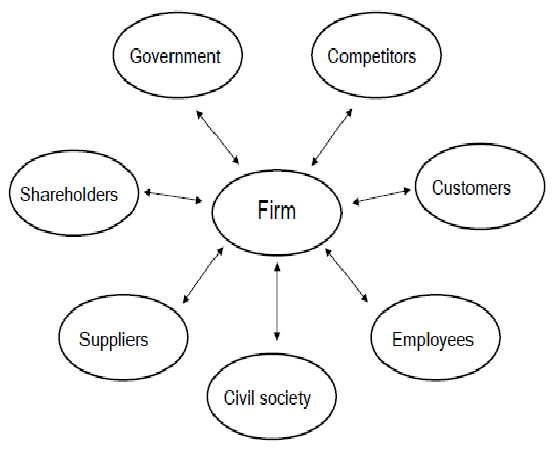

Lors d'un récent atelier qui portait sur les rôles et responsabilités autour d'un produit, un groupe qui avait été d'abord identifié comme un client a été requalifié en partie prenante. A cette occasion, je me suis rendu compte que j'avais un doute : les clients sont-ils des parties prenantes ou pas ? <!-- end -->

Scrum utilise le mot de partie prenante sans le définir. Et la définition qu'il donne d'un produit laisse une ambiguïté sur le fait que ce sont deux groupes distincts ou que l'un (partie prenante) inclue l'autre (client) :

> Un produit est un vecteur de valeur. Il a une limite claire, des parties prenantes connues, des utilisateurs ou des clients bien définis.
> 
> — [Scrum Guide 2020](https://scrumguides.org/docs/scrumguide/v2020/2020-Scrum-Guide-French.pdf)

En faisant des recherches pour répondre à cette question, j'ai découvert [un article approfondi sur les parties prenantes](https://www.cairn.info/revue-des-sciences-de-gestion-2007-1-page-109.htm). 

J'ai compris plusieurs choses en le lisant.
D'abord, que l'expression partie prenante se rapporte d'abord à l'entreprise et qu'il faut donc préciser quand on l'utilise dans le contexte plus restreint d'un produit.

Ensuite, que le concept est bien plus complexe que ce que j'avais imaginé. En particulier il soulève la question de la responsabilité sociétale des entreprises. Il a même donné lieu à plusieurs théories dont la plus connue est celle de Edward Freeman, publiée en 1984.

Cet article retrace les différentes définitions proposées au fil du temps.
Je retiens celle qui est la plus large et qui est donnée par Freeman et Reed :

> Une partie prenante dans l’organisation est [par définition] tout groupe d’individus ou tout individu qui peut affecter ou être affecté par la réalisation des objectifs organisationnels.
> 
> — Freeman RE & Reed LR (1983), « Stockholders and Stakeholders : a new Perspective on Corporate Gouvernance », California Management Review, vol 25, n° 3, 88-106.

En 1984, il ajoute à sa définition un schéma particulièrement clair où figurent les clients.

En lisant ces définitions, j'ai retrouvé en partie la définition que m'avait donnée un jour Arie van Bennekum pendant une de ses formations et qui m'a beaucoup servi pour expliquer le concept lors des formations que j'ai pu donner moi-même :

> Anyone who could stop a product from going live is a stakeholder.
> 
> — Arie van Bennekum. Agile Coach Academy, September 2020.

On y trouve bien la notion d'un individu qui peut affecter le produit. Il y manque néanmoins l'autre facette des individus qui peuvent être affectés par le produit.

Alors, *oui, les clients sont bien des parties prenantes*, que ce soit dans le contexte d'un projet/produit ou dans celui plus large de l'entreprise.

Pour conclure, on peut proposer une définition plus restreinte des parties prenantes d'un produit qui paraphrase Freeman :
*tout groupe d'individus ou tout individu qui peut affecter ou être affecté par la réalisation du produit.*