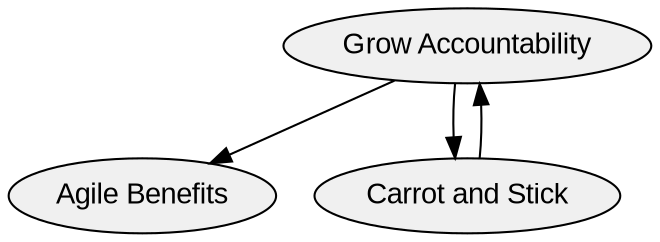

```dot
digraph graphname {
  node [ style = filled, fillcolor = "#F0F0F0", fontname="arial" ];

  agileBenefits [ label = "Agile Benefits", URL = "/content/agile-benefits/" ];
  growAccountability [ label = "Grow Accountability", URL = "/content/how-to-grow-accountability/" ];
  carrotAndStick [ label = "Carrot and Stick", URL = "/content/the-carrot-and-the-stick/" ];
  
  carrotAndStick -> growAccountability;
  growAccountability -> carrotAndStick;
  growAccountability -> agileBenefits;
}
```
