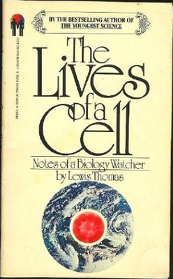

Recently, I was coaching a brand new team in a large French bank. Its backlog was almost empty and the Product Owner knew very little about its customers and their expectations. So I proposed to organize a workshop with a person who would be able to answer their questions. The Product Owner told me he would prefer to ask questions by email and get answers in the same way. I had to explain why talking is better than writing in this situation.
<!-- end -->

I have long been convinced that a written document is not the best way to convey information, especially about customer expectations. We know the word from Alistair Cockburn:

> A user story is a promise for a conversation.
> 
> — Alistair Cockburn

Writing a user story is good but not sufficient: we need to have a conversation to build a shared understanding of a topic.

Okay but even if it was written by an author of the Agile Manifesto, how can I convince someone this is right?

Some people believe that, if someone works hard enough, he’ll be able to write something in a perfectly clear way. I have designed two exercises that help changing this perception about our natural language. The first exercise shows how very simple and obvious instructions can be misinterpreted. The second one shows how easily we may understand the same phrase differently. They both demonstrate that our language can't prevent misunderstandings.

Great! That means our language is ambiguous. So what?

Looking for academic papers on ambiguity in our language, I found an article titled: [We’re Afraid Language Models Aren’t Modeling Ambiguity](https://arxiv.org/abs/2304.14399).

There was a quote in the introduction:

> Ambiguity seems to be an essential, indispensable element for the transfer of information from one place to another by words.
> 
> — Thomas (1974)

*That made me curious because I had an intuition for a long time that ambiguity was not a bad thing. But I could not figure out why.*

It was written by Lewis Thomas in his book *The Lives of a Cell: Notes of a Biology Watcher*.

Here is a larger quote of it:

> Perhaps it is in this respect that language differs most sharply from other biologic systems for communication. **Ambiguity seems to be an essential, indispensable element for the transfer of information from one place to another by words**, where matters of real importance are concerned. It is often necessary, for meaning to come through, that there be an almost vague sense of strangeness and askewness. Speechless animals and cells cannot do this. The specifically locked-on antigen at the surface of a lymphocyte does not send the cell off in search of something totally different; when a bee is tracking sugar by polarized light, observing the sun as though consulting his watch, he does not veer away to discover an unimaginable marvel of a flower. *Only the human mind is designed to work in this way, programmed to drift away in the presence of locked-on information, straying from each point in a hunt for a better, different point.*
> 
> If it were not for the capacity for ambiguity, for the sensing of strangeness, that words in all languages provide, we would have no way of recognizing the layers of counterpoint in meaning, and we might be spending all our time sitting on stone fences, staring into the sun. To be sure, we would always have had some everyday use to make of the alphabet, and we might have reached the same capacity for small talk, but it is unlikely that we would have been able to evolve from words to Each. *The great thing about human language is that it prevents us from sticking to the matter at hand.*
> 
> — Lewis Thomas, [The Lives of a Cell: Notes of a Biology Watcher](https://www.amazon.com/Lives-Cell-Notes-Biology-Watcher/dp/0140047433/). 1974.

In other words, ambiguity is not a language flaw that we need to fix.
It is a way to go beyond what is said.

What does it mean for us?

1. Whatever we do, a document will always remain ambiguous.
2. Ambiguity is not a language flaw; it is an advantage.
3. The only way to remove ambiguities, is to ask clarifying questions.
4. By asking question, we not only disambiguate meanings but enrich the topic.

And obviously, a conversation is more efficient than a long thread of emails.