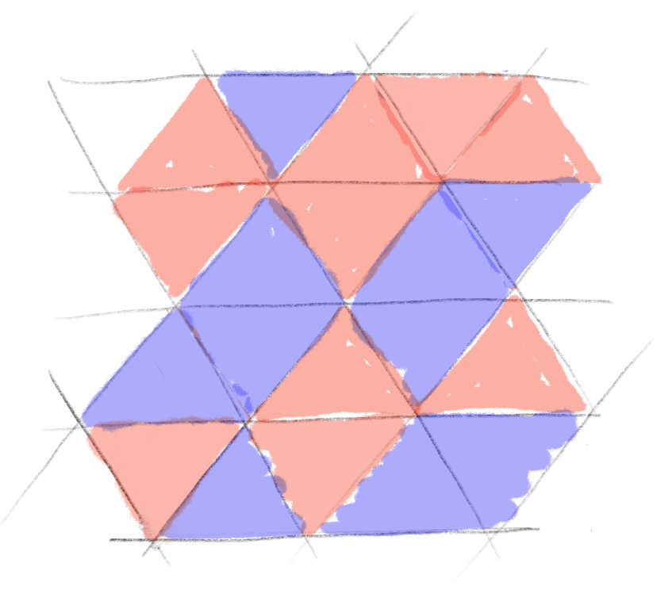

Teams often find it hard to split large backlog items into smaller ones. And it is even more difficult to split items while preserving value. So it’s important to make clear that splitting has an impact on value.<!-- end -->

### Start with with a mesh of triangles

### Equal number of blue and red triangles

Color triangles so that you have 10 blue triangles and 10 red triangles.

### Equal regions

Draw boundaries so that you get 4 regions of 5 triangles.
Two of them should include a majority (3) of blue triangles.
Two of them should include a majority (3) of red triangles.

### Unequal regions

Remove the previous boundaries. Then ask the participants to draw boundaries so that they still get 4 regions of 5 triangles but with more regions with a majority of red triangles than regions with a majority of blue triangles.

### One possible solution

### Conclusion

Even if you have an equal distribution of red and blue triangles, you may find boundaries that will change the *value* of the regions (who has the majority).

This is what we call gerrymandering.